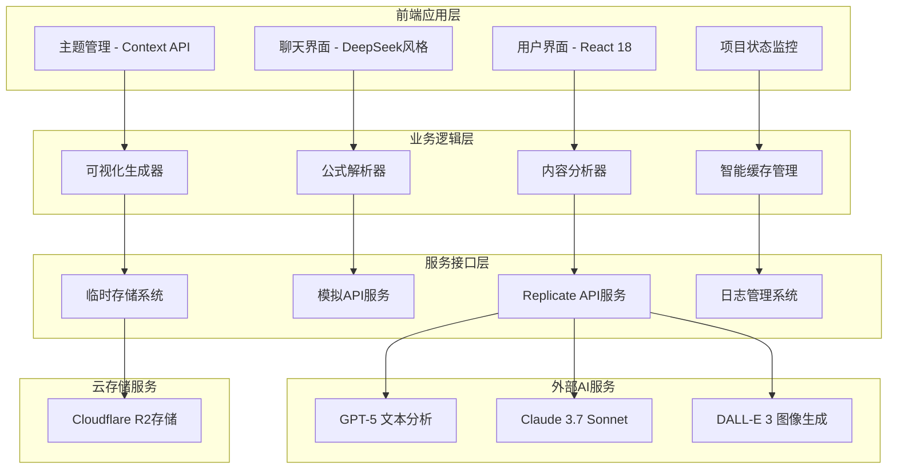
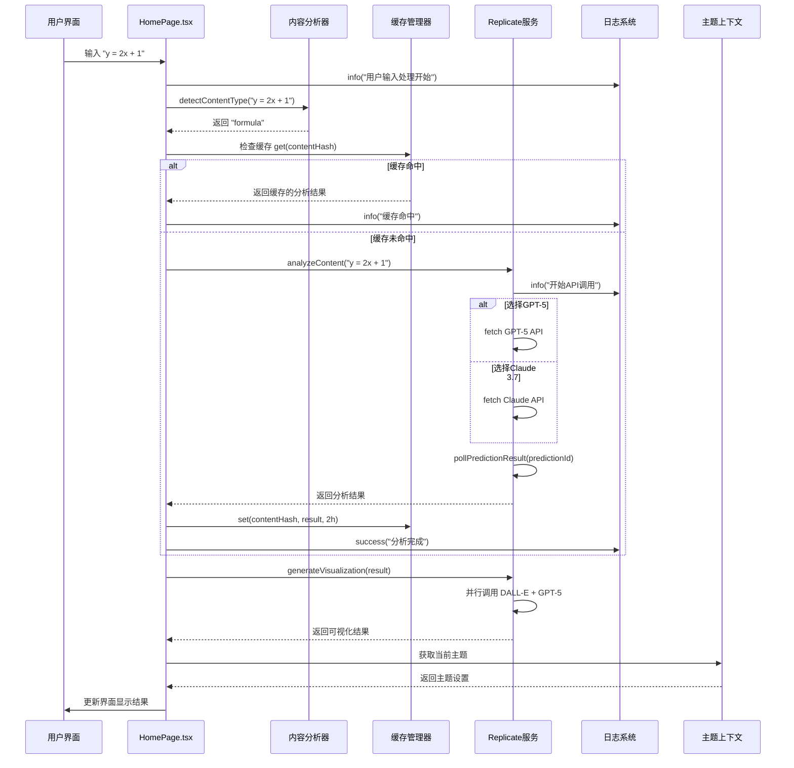

# EduVisualizer 2.0 项目架构分析完整文档

## 📋 项目概览

**EduVisualizer 2.0** 是一个智能教育内容可视化工具，专门设计用于分析数学公式、解读教育内容，并生成可视化图表的现代React应用。

### 🌟 核心特征

- **双AI模型支持**: GPT-5 + Claude 3.7 Sonnet
- **智能内容分析**: 自动识别公式、文本内容类型  
- **多元化可视化**: Chart.js、SVG、D3.js代码生成
- **完整的降级机制**: 本地分析模式和模拟API
- **企业级架构**: 缓存管理、日志系统、错误处理

## 🏗️ 系统架构分析

### 整体架构图



### 技术栈分析

| 层级 | 技术选型 | 作用 | 优势 |
|------|---------|------|------|
| **前端框架** | React 18 + TypeScript | 用户界面和状态管理 | 现代化、类型安全 |
| **构建工具** | Vite | 开发服务器和构建 | 快速、模块化 |
| **样式系统** | Tailwind CSS | UI样式和响应式设计 | 原子化、可定制 |
| **动画库** | Framer Motion | 界面动画和交互 | 流畅、声明式 |
| **AI服务** | Replicate API | AI模型集成 | 多模型、稳定 |
| **缓存系统** | 自定义CacheManager | 性能优化 | 智能、可配置 |
| **日志系统** | 自定义Logger | 调试和监控 | 结构化、可导出 |
| **云存储** | Cloudflare R2 | 文件存储 | 成本低、性能好 |

## 📁 详细文件结构分析

### 项目目录结构

```
EduVisualizer 2.0/
├── 📄 配置文件层
│   ├── package.json                 # 项目依赖和脚本 (46行)
│   ├── vite.config.ts               # 构建配置 (32行)
│   ├── .env.local                   # 环境变量 (15行)
│   ├── tailwind.config.js           # 样式配置
│   └── tsconfig.json                # TypeScript配置
│
├── 📁 public/                       # 静态资源目录
│   └── vite.svg                     # Vite图标
│
├── 📁 src/                          # 源代码目录
│   ├── 📄 main.tsx                  # 应用入口 (13行)
│   ├── 📄 index.css                 # 全局样式
│   │
│   ├── 📁 pages/                    # 页面组件
│   │   └── HomePage.tsx             # 主页面 (838行) - 核心业务逻辑
│   │
│   ├── 📁 context/                  # React Context
│   │   └── ThemeContext.tsx         # 主题上下文 (85行)
│   │
│   ├── 📁 components/               # UI组件
│   │   └── ProjectStatus.tsx        # 项目状态 (309行)
│   │
│   ├── 📁 services/                 # API服务
│   │   ├── replicateAPI.ts          # Replicate集成 (717行)
│   │   └── mockAPI.ts               # 模拟API (293行)
│   │
│   ├── 📁 utils/                    # 工具函数
│   │   ├── logger.ts                # 日志系统 (260行)
│   │   ├── cacheManager.ts          # 缓存管理 (487行)
│   │   └── temporaryStorage.ts      # 临时存储
│   │
│   ├── 📁 types/                    # 类型定义
│   │   └── index.ts                 # 类型系统 (217行)
│   │
│   ├── 📁 hooks/                    # 自定义Hooks
│   │   └── useLocalStorage.ts       # 本地存储Hook
│   │
│   ├── 📁 assets/                   # 静态资源 (空)
│   └── 📁 styles/                   # 样式文件 (空)
│
└── 📁 dist/                         # 构建输出 (构建时生成)
```

### 核心文件深度解析

#### 1. **src/main.tsx (13行)** - 应用入口点
```typescript
// 职责：React应用初始化、主题提供者设置、根组件渲染
import React from 'react'
import ReactDOM from 'react-dom/client'
import { ThemeProvider } from './context/ThemeContext'
import HomePage from './pages/HomePage'
import './index.css'

// 依赖关系：ThemeProvider → HomePage → index.css
```

#### 2. **src/pages/HomePage.tsx (838行)** - 核心业务控制器
```typescript
// 关键功能模块：
// • 状态管理模块 - messages, inputText, isProcessing, selectedModel
// • API可用性检查 - checkAPIAvailability(), 环境变量验证
// • 内容分析器 - detectContentType(), 公式检测, 文本分类
// • 消息处理器 - addUserMessage(), addAssistantMessage(), updateMessage()
// • 输入处理器 - handleSendMessage(), processUserInput(), handleLocalAnalysis()
// • UI组件 - MessageBubble, 聊天界面, 模型选择器

// 核心调用链：
handleSendMessage() 
  → detectContentType()           // 检测内容类型（公式/文本/混合）
  → processUserInput()           // 核心处理逻辑
    → analyzeFormulaText()       // 公式分析（如果是公式类型）
    → aiService.analyzeContent() // AI内容分析
    → apiService.generateVisualization() // 可视化生成
  → generateResponseContent()    // 生成响应内容
  → updateMessage()             // 更新UI显示
```

#### 3. **src/services/replicateAPI.ts (717行)** - AI服务核心
```typescript
// AI服务架构：
// • RequestQueue类 - 并发控制, 队列管理, 最大3个并发请求
// • EduVisualizerAIService类 - AI服务主类
//   - extractText() - OCR文字识别
//   - parseFormulas() - 公式解析
//   - generateVisualization() - 可视化生成
//   - analyzeContent() - GPT-5内容分析
//   - analyzeContentWithClaude() - Claude分析
// • 轮询机制 - pollPredictionResult(), 最大50次尝试, 3秒间隔轮询
// • 错误处理 - API调用失败处理, 超时处理, 降级方案

const API_CONFIG = {
  models: {
    gpt5: 'openai/gpt-5',                    // GPT-5文本分析
    claude37: 'anthropic/claude-3.7-sonnet', // Claude 3.7 Sonnet
    dalleE3: 'openai/dall-e-3',              // DALL-E 3图像生成
    llama2: 'meta/llama-2-70b-chat'          // 备选模型
  }
}
```

#### 4. **src/utils/cacheManager.ts (487行)** - 企业级缓存系统
```typescript
// 缓存架构：
// • CacheManager核心类 - Map数据结构, 泛型支持, 多策略支持
// • 驱逐策略 - LRU(最近最少使用), LFU(最不经常使用), FIFO(先进先出)
// • TTL管理 - 过期时间检查, 自动清理, 定时器管理
// • 缓存实例:
//   - apiResultCache - API结果 (20MB/2h)
//   - fileContentCache - 文件内容 (30MB/4h)  
//   - sessionCache - 会话数据 (10MB/24h)
// • 统计分析 - 命中率统计, 大小监控, 性能分析

// 缓存键生成策略：
export const CacheKeys = {
  ocrResult: (fileHash: string) => `ocr:${fileHash}`,
  formulaResult: (fileHash: string) => `formula:${fileHash}`,
  analysisResult: (contentHash: string) => `analysis:${contentHash}`,
  visualizationResult: (dataHash: string, style: string) => `viz:${dataHash}:${style}`
}
```

#### 5. **src/utils/logger.ts (260行)** - 日志系统
```typescript
// 日志架构：
// • 日志级别 - INFO(信息), WARN(警告), ERROR(错误), SUCCESS(成功)
// • 日志存储 - 内存数组, 结构化存储, 时间戳记录
// • 输出机制 - 开发环境控制台, 彩色输出, 上下文标记
// • 导出功能 - JSON格式, 日志过滤, 统计分析
// • 全局暴露 - window.__EDU_LOGGER__ 用于调试
```

## 🔄 详细数据流分析

### 用户输入处理完整流程



## 📊 文件依赖矩阵

| 文件 | 依赖文件 | 被依赖文件 | 核心职责 |
|------|----------|------------|----------|
| **main.tsx** | ThemeContext, HomePage, index.css | - | 应用入口，初始化 |
| **HomePage.tsx** | replicateAPI, mockAPI, logger, types, ThemeContext | main.tsx | 核心业务逻辑，用户交互 |
| **replicateAPI.ts** | logger, temporaryStorage, types | HomePage, mockAPI | AI服务集成，API调用 |
| **mockAPI.ts** | logger, types | HomePage | 离线演示，降级方案 |
| **logger.ts** | - | HomePage, replicateAPI, mockAPI, cacheManager, ProjectStatus | 日志记录，调试支持 |
| **cacheManager.ts** | logger | replicateAPI | 性能优化，数据缓存 |
| **ThemeContext.tsx** | useLocalStorage | main.tsx, HomePage | 主题管理，用户偏好 |
| **ProjectStatus.tsx** | logger | HomePage | 状态监控，系统诊断 |
| **types/index.ts** | - | 所有组件 | 类型定义，类型安全 |

## 🏗️ 架构设计模式

1. **分层架构模式** - 清晰的入口→页面→服务→工具层次
2. **策略模式** - 多种缓存驱逐策略、多AI模型选择
3. **观察者模式** - 主题变化、状态更新通知
4. **工厂模式** - 缓存工厂函数、API服务实例
5. **装饰器模式** - 日志装饰、错误处理装饰

## 📂 目录使用指南

### 目录分类详解

#### 🔧 需要手动创建和编辑的文件

**📄 配置文件（项目初始化时创建）**
- `package.json` - 项目依赖和脚本
- `.env.local` - API密钥配置
- `vite.config.ts` - 构建配置
- `tailwind.config.js` - 样式配置

**💻 源代码文件（主要编辑的）**
- `src/main.tsx` - 应用入口
- `src/pages/HomePage.tsx` - 主页面（838行核心代码）
- `src/context/ThemeContext.tsx` - 主题管理
- `src/services/` - AI服务集成
- `src/components/` - UI组件
- `src/utils/` - 工具函数
- `src/types/` - 类型定义

#### 🤖 自动生成的文件（不要手动修改）

- `package-lock.json` - 依赖版本锁定
- `dist/` 目录 - 构建后的生产文件
- `node_modules/` - 下载的依赖包

### 开发场景指南

#### 场景1：修改聊天界面的样式和布局
**主要编辑：** `src/pages/HomePage.tsx`

#### 场景2：添加新的AI模型支持
**主要编辑：** `src/services/replicateAPI.ts`

#### 场景3：修改主题颜色
**主要编辑：** `src/context/ThemeContext.tsx` 和 `tailwind.config.js`

#### 场景4：添加新的页面组件
**需要创建：** `src/components/YourNewComponent.tsx`

#### 场景5：修改API配置
**主要编辑：** `.env.local`

## 🎯 架构优势

### 核心亮点

1. **高可维护性**
   - 清晰的分层架构
   - TypeScript全面类型保护
   - 模块化设计原则

2. **强大的容错性**
   - 多层降级机制
   - 本地分析模式
   - 智能错误处理

3. **优秀的性能**
   - 智能缓存系统
   - 请求队列管理
   - 异步处理机制

4. **企业级特性**
   - 完整的日志系统
   - 项目状态监控
   - 配置管理

### 技术价值

- **高内聚低耦合**：每个文件职责明确，依赖关系清晰
- **容错设计**：三层降级机制（真实API → 本地分析 → 模拟API）
- **性能优化**：智能缓存、请求队列、并发控制
- **开发友好**：完整类型系统、结构化日志、状态监控
- **可扩展性**：模块化设计、策略模式、依赖注入

## 🚀 改进建议

### 短期优化 (1-2周)
1. **API优化**
   - 实现请求去重机制
   - 添加API响应时间监控
   - 优化错误重试逻辑

2. **缓存增强**
   - 添加缓存预热功能
   - 实现分布式缓存支持
   - 优化缓存键生成策略

### 中期改进 (1-2个月)
1. **功能扩展**
   - 集成真实OCR服务 (Google Vision API)
   - 实现文件上传和预览
   - 添加用户会话管理

2. **性能提升**
   - 实现代码分割和懒加载
   - 添加Service Worker缓存
   - 优化bundle大小

### 长期规划 (3-6个月)
1. **架构演进**
   - 微前端架构升级
   - 服务端渲染支持
   - PWA功能实现

2. **监控运维**
   - 实时性能监控
   - 用户行为分析
   - 自动化部署流程

## 📋 总结

EduVisualizer 2.0 是一个设计精良的现代教育技术应用，展现了以下特色：

**🏆 核心亮点:**
- **双AI模型架构**: GPT-5与Claude 3.7的完美结合
- **智能降级机制**: 保证在任何情况下的可用性
- **企业级工程实践**: 完整的日志、缓存、监控系统
- **用户体验优先**: DeepSeek风格的聊天界面和实时反馈

**⭐ 技术价值:**
- 代码质量高，架构设计合理
- TypeScript全覆盖，类型安全
- 模块化程度高，便于维护和扩展
- 性能优化到位，用户体验良好

这个项目非常适合作为现代React应用的参考案例，特别是在AI集成、缓存管理和用户界面设计方面都体现了最佳实践。对于小白开发者来说，这是一个学习现代前端开发的绝佳项目。

---

*本文档基于对EduVisualizer 2.0项目的深度架构分析生成，涵盖了从系统设计到具体实现的完整技术栈分析。*